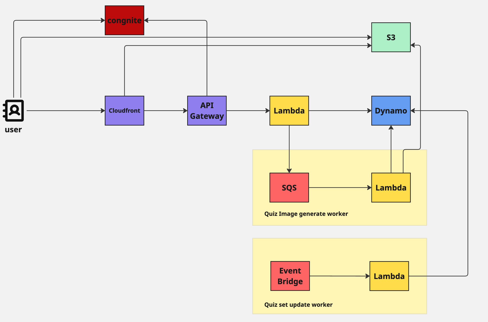

# guess-the-celebrity

## アプリケーションの説明

Guess the Celebrityは、画像の一部をヒントに有名人を当てる4択クイズアプリケーションである。
ユーザーは公開されたクイズに回答でき、アカウント登録後は画像の表示範囲、問題文、選択肢、難易度を設定してクイズを作成・公開できる。

URL: https://main.d8lcxn6e5s253.amplifyapp.com/

## アーキテクチャ

### Overview

本アプリケーションは、ユーザー操作に対する待ち時間を最小化することを重視して設計している。
クイズの取得や回答といった頻度の高い処理では、リクエスト時に行う処理をできるだけ少なくし、時間のかかる処理は非同期処理や事前計算へ移している。

- 公開クイズは定期実行するFeed Workerがあらかじめ問題セットとしてDynamoDBに集約し、クイズ取得APIは1件のデータ取得と問題選択だけを行う。
- 画像はPresigned URLを利用してクライアントからS3へ直接アップロードし、APIサーバーを経由するデータ転送を避けている。
- クイズ画像の生成はSQSとImage Workerへ切り離し、画像処理の完了をAPIレスポンスが待たない構成にしている。
- 回答結果の表示中にフロントエンドが次のクイズを先読みし、次問へ進む際の待ち時間を短縮している。

## パフォーマンス

### クイズ取得API

本番環境の`GET /api/quizzes/random`を対象に、2026年7月10日に計測した。

| 指標 | Amplify経由のHTTP応答時間 | Lambda実行時間 |
| --- | ---: | ---: |
| p50 | 58.91 ms | 5.43 ms |
| p95 | 110.94 ms | 19.96 ms |
| p99 | 122.65 ms | 37.05 ms |
| max | 329.75 ms | 59.93 ms |

- リージョン: `ap-northeast-1`
- 負荷: 5 requests/second、5分間
- 計測リクエスト: 1,501件（事前のウォームアップ3件を除く）
- Lambda Invocation: 1,504件
- エラー率: 0%
- 計測中のコールドスタート: 0回
- Lambdaメモリ: 128 MB
- Reserved Concurrency / Provisioned Concurrency: 未設定

HTTP応答時間は、k6からAmplifyの本番URLへリクエストし、Amplify、API Gateway、Lambda、DynamoDBを通ってレスポンスを受け取るまでを計測している。テスト開始前に3リクエストを送信し、このウォームアップは集計対象から除外している。計測には[`performance/k6/random-quiz.js`](performance/k6/random-quiz.js)を使用した。

Lambda実行時間は、CloudWatch Logs Insightsで`/aws/lambda/guess_the_celebrity_api`ロググループを選択し、同じ計測時間帯にLambdaプラットフォームが出力した`REPORT`ログの`@duration`を集計した。
